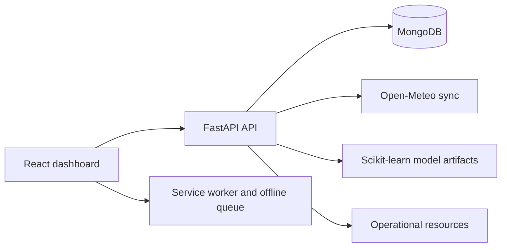

# RiskPulse Architecture

## Runtime Flow

## Frontend

The React application owns navigation, responsive presentation, local authentication state, mock/live data selection, and offline report queuing. Route-level lazy loading keeps maps and analytics from blocking the initial shell.

## Backend

FastAPI exposes separate API modules for locations, observations, reports, risk calculations, multi-hazard assessment, ML predictions, and operational resources. MongoDB is the system of record for observations and assessments.

## Data Boundaries

- `weather_observations`: rainfall and forecast observations
- `sensor_readings`: water-level and connectivity measurements
- `citizen_reports`: field observations with verification and reliability
- `risk_assessments`: calculated risk snapshots
- `hazard_assessments`: multi-hazard signals and response priorities
- `resources`: shelters, routes, rescue, pump, and medical resources
- `ml_predictions`: prediction history and request inputs

## Extension Points

Provider adapters should be added behind service modules for satellite imagery, terrain processing, road routing, SMS, and ocean observations. They should preserve source, timestamp, reliability, and failure state instead of silently substituting defaults.
